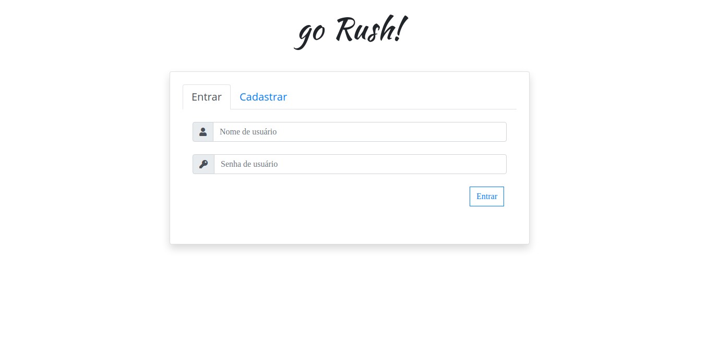
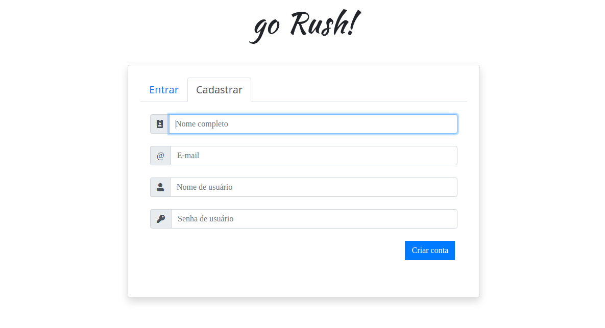
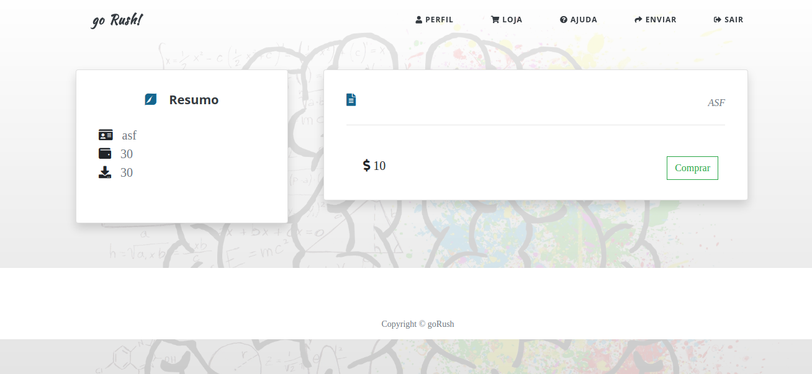
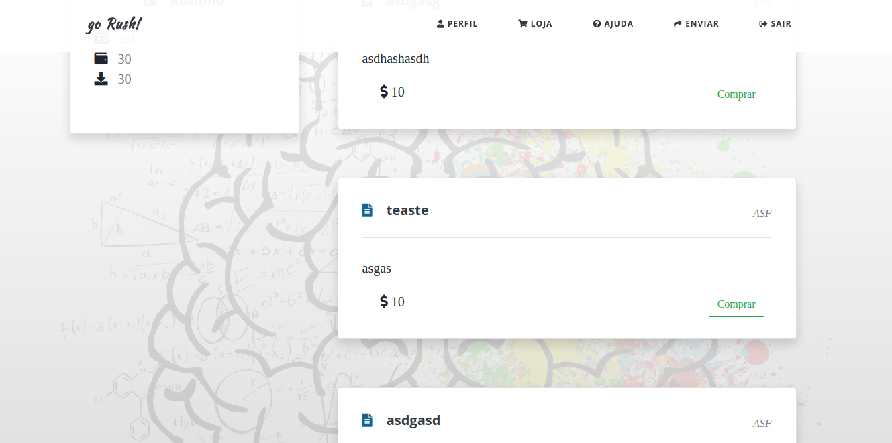
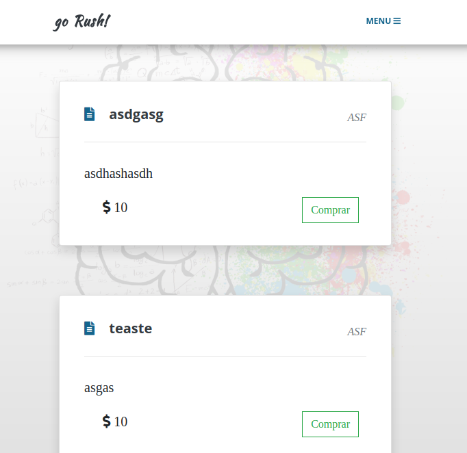

# GoRush!

> Project idealized in human interface classes. This is a simple website model using nodejs. The mainly idea about this site it's a platform to sell and buy academic contents. In this platform, you could buy an video explication or papers of your interest. Furthermore, this would work like an rewards scaling. When you reach a certain level of sharing/buying contents, you could also do the homework of others (receiving money).

---

## Overview

1. Login



2. Sign up
   
   

3. Home screen with empty DataBase
   
   

4. Bug
   
   

5. Home
   
   

6. Store (desktop)
   
   

7. Store (mobile)
   
   

8. Menu (deskto)
   
   

9. Menu (mobile)
   
   

10. Send content
    
    

---

### Node and node libraries

```bash
curl -sL https://deb.nodesource.com/setup_12.x | sudo -E bash -
sudo apt update
sudo apt install nodejs

npm install
npm install express
npm install socket
npm install ejs
```

### Database install and config

In the newest versions of MySql, there's an problem with nodejs auth method with database, see [here](https://stackoverflow.com/questions/50093144/mysql-8-0-client-does-not-support-authentication-protocol-requested-by-server).

```bash
# Install docker environment
curl -fsSL https://download.docker.com/linux/ubuntu/gpg | sudo apt-key add -
sudo add-apt-repository \
   "deb [arch=amd64] https://download.docker.com/linux/ubuntu \
   $(lsb_release -cs) \
   stable"
sudo apt-get update
sudo apt-get install docker-ce docker-ce-cli containerd.io
sudo usermod -aG docker $USER
# Logout and login again

# Configure the database and the connection port
docker \
  run \
  --detach \
  --env MYSQL_ROOT_PASSWORD=ppcamproot \
  --env MYSQL_USER=ppcamp \
  --env MYSQL_PASSWORD=ppcamp \
  --env MYSQL_DATABASE=gorush \
  --name mysqlDB \
  --publish 5432:3306 \
  mysql:5.7
# You can change the volume, however, you won't be able
# to track them in vscode.
# --volume $HOME/mysqlDB:/var/lib/mysql \

# Log into (using an docker it or vscode)
mysql -Dgorush -uppcamp -pppcamp
```

```sql
show databases;
-- Tables
CREATE TABLE `conteudo` (
    `id_conteudo` int NOT NULL AUTO_INCREMENT,
    `titulo` varchar(30) NOT NULL,
    `texto` text NOT NULL,
    `logins_nick` varchar(15) NOT NULL,
    CONSTRAINT `conteudo_pk` PRIMARY KEY (`id_conteudo`)
);
CREATE TABLE `historicoCompra` (
    `id_historicoCompra` int NOT NULL AUTO_INCREMENT,
    `dataHora` timestamp NOT NULL,
    `valor` int NOT NULL,
    `logins_nick` varchar(15) NOT NULL,
    CONSTRAINT `historicoCompra_pk` PRIMARY KEY (`id_historicoCompra`)
);
CREATE TABLE `historicoInsert` (
    `id_historicoInsert` int NOT NULL AUTO_INCREMENT,
    `dataHora` timestamp NOT NULL,
    `logins_nick` varchar(15) NOT NULL,
    `valor` int NOT NULL,
    CONSTRAINT `historicoInsert_pk` PRIMARY KEY (`id_historicoInsert`)
);
CREATE TABLE `logins` (
    `nome` varchar(30) NOT NULL,
    `senha` varchar(30) NOT NULL,
    `nick` varchar(15) NOT NULL,
    `credito` int NOT NULL,
    `email` varchar(40) NOT NULL,
    CONSTRAINT `logins_pk` PRIMARY KEY (`nick`)
);
-- foreign keys
-- Reference: conteudo_logins (table: conteudo)
ALTER TABLE `conteudo` ADD CONSTRAINT `conteudo_logins` FOREIGN KEY `conteudo_logins` (`logins_nick`)
    REFERENCES `logins` (`nick`);

-- Reference: historicoCompra_logins (table: historicoCompra)
ALTER TABLE `historicoCompra` ADD CONSTRAINT `historicoCompra_logins` FOREIGN KEY `historicoCompra_logins` (`logins_nick`)
    REFERENCES `logins` (`nick`);

-- Reference: historico_saldo_credito_logins (table: historicoInsert)
ALTER TABLE `historicoInsert` ADD CONSTRAINT `historico_saldo_credito_logins` FOREIGN KEY `historico_saldo_credito_logins` (`logins_nick`)
    REFERENCES `logins` (`nick`);
```

---

### Comments

> @ppcamp
> 
> [Sessions in node](https://codeforgeek.com/manage-session-using-node-js-express-4/)
